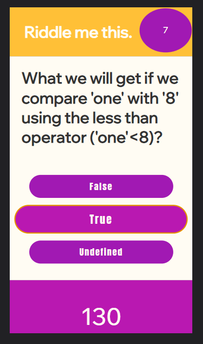

# Riddle me this.
A simple JavaScript-based quiz game

Modular quiz game. Questions can be added in object format in the questions.js file. Currently it has six real tough questions about JavaScript.

The high score table is dynamically generated in the script based on local storage, and is saved to local storage if you get a high score. It has some default values.

It has some pizzaz in that the timer is animated to bounce on seconds elapsing and gets all big and stuff when there is five or less seconds on the clock.

But they were, all of them, deceived, for another branch was made. This is a branch where I more closely matched the class criteria. I don't even read the criteria first. The original is [available on github](https://github.com/stanjosh/quizgame/) as well.

## Wow, that's super cool. How do I play?

[Why, here is is! On the world wide web, no less!](https://stanjosh.github.io/quizgame/)

## Screenshots

